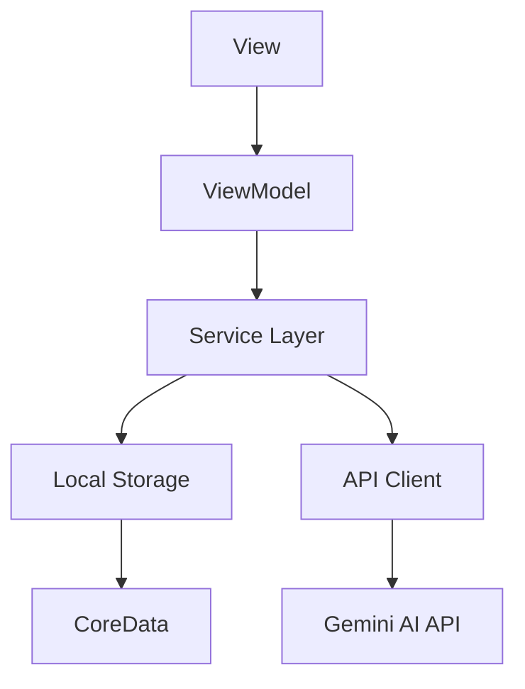

# 📚 StoryTime

An immersive iOS story creation and reading app powered by AI, offering interactive storytelling experiences through advanced natural language processing and dynamic narrative generation.


## 📖 Table of Contents
- [Core Features](#-core-features)
- [Technical Overview](#-technical-overview)
- [Installation](#-installation)
- [Architecture](#-architecture)
- [UI Components](#-ui-components)
- [AI Integration](#-ai-integration)
- [Performance](#-performance)
- [Security](#-security)
- [Contributing](#-contributing)
- [Documentation](#-documentation)
- [Testing](#-testing)
- [Deployment](#-deployment)
- [License](#-license)

## 🌟 Core Features

### 🤖 AI Story Generation Engine
- **Advanced Prompt System**
  - Context-aware story generation
  - Genre-specific templates
  - Character development frameworks
  - Plot structure guidance
- **Real-time Generation**
  - Progressive story loading
  - Continuous generation feedback
  - Error handling and recovery
- **Customization Options**
  - Style adaptation
  - Tone control
  - Length management
  - Complexity settings

### 📚 Story Management System
- **Library Organization**
  - Custom collections
  - Smart folders
  - Tags and categories
  - Search functionality
- **Reading Progress**
  - Bookmarking system
  - Progress synchronization
  - Reading statistics
  - Achievement system
- **Content Filtering**
  - Age-appropriate content control
  - Genre filtering
  - Length-based sorting
  - Popularity metrics

### 🎮 Interactive Reading Experience
- **Dynamic Content**
  - Branching narratives
  - Choice-based progression
  - Multiple endings
  - Character relationships
- **Accessibility Features**
  - VoiceOver support
  - Dynamic type
  - Custom font options
  - High contrast modes
- **Reading Modes**
  - Night mode
  - Sepia mode
  - Custom themes
  - Font customization

## 🔧 Technical Overview

### System Requirements
- **iOS Requirements**
  - iOS 17.0 or later
  - 64-bit devices only
  - Minimum 2GB RAM
  - 100MB free space
- **Development Requirements**
  - Xcode 15.0+
  - Swift 5.9+
  - macOS Sonoma 14.0+
  - Git 2.3.0+

### Dependencies
```ruby
# Podfile
pod 'Alamofire', '~> 5.8.0'
pod 'SwiftyJSON', '~> 5.0.0'
pod 'Realm', '~> 10.45.0'
pod 'Lottie', '~> 4.3.0'
pod 'SwiftLint', '~> 0.52.0'
```

### Environment Variables
```bash
GEMINI_API_KEY=your_api_key
ENVIRONMENT=development|staging|production
DEBUG_LEVEL=verbose|info|warning|error
FEATURE_FLAGS={"newReader":true,"aiGeneration":true}
```

## 🚀 Installation

### Manual Installation
```bash
# Clone the repository
git clone https://github.com/yourusername/storytime-2.0.git

# Navigate to project directory
cd storytime-2.0

# Install dependencies
pod install

# Open workspace
open StoryTime.xcworkspace
```

### Configuration
1. Create `Configuration.plist` in the project root
2. Add required API keys and environment variables
3. Select appropriate build scheme
4. Build and run the project

## 🏗️ Architecture

### MVVM Implementation
```swift
// Example ViewModel Structure
class StoryViewModel: ObservableObject {
    @Published var stories: [Story] = []
    @Published var isLoading: Bool = false
    private let storyService: StoryService
    
    init(storyService: StoryService = StoryService()) {
        self.storyService = storyService
    }
    
    func fetchStories() async {
        isLoading = true
        defer { isLoading = false }
        
        do {
            stories = try await storyService.fetchStories()
        } catch {
            // Error handling
        }
    }
}
```

### Data Flow


## 🎨 UI Components

### Core Components
- **Story Card**
  - Adaptive layout
  - Gesture handling
  - Animations
  - State management
- **Reading View**
  - Custom page transitions
  - Progress indicator
  - Navigation controls
  - Interactive elements
- **Editor Interface**
  - Rich text support
  - Real-time preview
  - Formatting tools
  - Version control

### Design System
```swift
struct StoryTimeColors {
    static let primary = Color("PrimaryBlue")
    static let secondary = Color("SecondaryGreen")
    static let accent = Color("AccentOrange")
    static let background = Color("BackgroundGray")
    static let text = Color("TextColor")
}

struct StoryTimeFonts {
    static let title = Font.custom("Merriweather-Bold", size: 24)
    static let body = Font.custom("OpenSans-Regular", size: 16)
    static let caption = Font.custom("OpenSans-Light", size: 14)
}
```

## 🤖 AI Integration

### Gemini AI Setup
```swift
class GeminiService {
    private let apiKey: String
    private let baseURL = "https://api.gemini.ai/v1"
    
    init() {
        guard let apiKey = Bundle.main.infoDictionary?["GEMINI_API_KEY"] as? String else {
            fatalError("Gemini API Key not found")
        }
        self.apiKey = apiKey
    }
    
    func generateStory(prompt: String) async throws -> Story {
        // AI story generation implementation
    }
}
```

### Story Generation Pipeline
1. Prompt Processing
2. Context Analysis
3. Story Generation
4. Content Filtering
5. Format Conversion
6. Quality Assurance

## ⚡ Performance

### Optimization Techniques
- **Memory Management**
  - Image caching
  - View recycling
  - Resource pooling
- **Network Optimization**
  - Request batching
  - Response caching
  - Compression
- **Storage Efficiency**
  - Data normalization
  - Incremental loading
  - Cache management

### Benchmarks
| Operation | Target Time | Current Average |
|-----------|-------------|-----------------|
| App Launch | < 2s | 1.8s |
| Story Load | < 1s | 0.7s |
| AI Generation | < 5s | 4.2s |
| Save Story | < 0.5s | 0.3s |

## 🔒 Security

### Data Protection
- End-to-end encryption for user stories
- Secure storage of API keys
- Network security measures
- Input validation

### Privacy Features
- Local data processing
- Anonymous analytics
- GDPR compliance
- Data retention policies

## 🤝 Contributing

### Development Workflow
1. Fork the repository
2. Create feature branch
3. Implement changes
4. Add tests
5. Submit pull request

### Code Style
```swift
// Example style guide
struct ExampleView: View {
    // MARK: - Properties
    @State private var isLoading: Bool = false
    
    // MARK: - Body
    var body: some View {
        VStack {
            if isLoading {
                ProgressView()
            } else {
                ContentView()
            }
        }
    }
    
    // MARK: - Private Methods
    private func loadContent() {
        // Implementation
    }
}
```

## 📚 Documentation

### API Reference
- [Story Generation API](/docs/api/story-generation.md)
- [User Management API](/docs/api/user-management.md)
- [Content Management API](/docs/api/content-management.md)

### Guides
- [Getting Started](/docs/guides/getting-started.md)
- [Architecture Overview](/docs/guides/architecture.md)
- [Contributing Guide](/docs/guides/contributing.md)

## ✅ Testing

### Test Coverage
```bash
# Run tests
xcodebuild test -workspace StoryTime.xcworkspace -scheme StoryTime -destination 'platform=iOS Simulator,name=iPhone 15 Pro'
```

### Testing Strategy
- Unit Tests
- Integration Tests
- UI Tests
- Performance Tests

## 📦 Deployment

### App Store Deployment
1. Version bump
2. Update changelog
3. Build release
4. Submit to App Store

### Beta Testing
- TestFlight distribution
- Beta testing groups
- Feedback collection
- Issue tracking

## 📄 License

This project is licensed under the MIT License - see the [LICENSE.md](LICENSE.md) file for details.

## 🙏 Acknowledgments

- [Gemini AI](https://gemini.google.com) for AI capabilities
- [SwiftUI](https://developer.apple.com/xcode/swiftui/) for UI framework
- [Swift Package Manager](https://swift.org/package-manager/) for dependency management
- Our amazing contributors and beta testers

## 📬 Contact & Support

- Email: support@storytime.app
- Twitter: [@StorytimeApp](https://twitter.com/StorytimeApp)
- Discord: [Join our community](https://discord.gg/storytime)

Project Link: [https://github.com/yourusername/storytime-2.0](https://github.com/yourusername/storytime-2.0)

---

Made with ❤️ by the StoryTime Team
